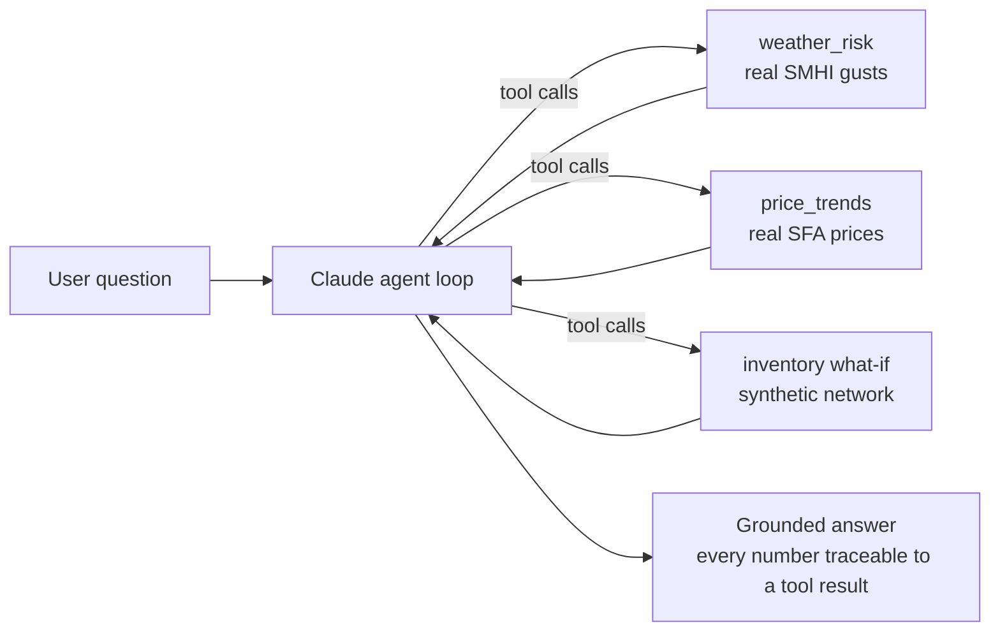

# supply-chain-copilot

**An LLM agent for supply-chain risk analysis, grounded in real public data and deterministic analytics.**

Ask it questions like *"If a windstorm cuts harvest supply by 40% for six weeks, which mill stocks out first?"* — and it answers by calling tested, deterministic tools over real Swedish weather and timber-price data, never by guessing numbers.

Built as a companion to my simulation project [RESILIENT-Forest](https://github.com/YOUR_USERNAME/resilient-forest), which found that **early warning is the best self-funding resilience intervention** in a regional forest supply chain. This project is the AI layer that makes such early warning usable: a conversational analyst over live risk signals.

## What it demonstrates

| Skill | Where |
|---|---|
| LLM agent engineering (tool use, agentic loop, grounding) | `src/copilot/agent.py`, `src/copilot/schemas.py` |
| Real-data pipelines with provenance (SHA-256 manifest, licenses) | `scripts/`, `data/raw/manifest.json` |
| Supply-chain domain modeling (stockout projection, HHI, safety stock) | `src/copilot/tools/` |
| Testing & evaluation of AI systems (unit tests + golden-question evals with a numeric-grounding check) | `tests/`, `evals/` |

## Architecture



The design inverts the usual "ask the LLM to analyze" pattern: **the LLM never computes domain numbers**. Deterministic, unit-tested Python does the arithmetic; the LLM orchestrates tools, interprets results, and communicates. The eval harness enforces this — every number in an answer must appear in a tool output.

## Data

| Dataset | Source | Type |
|---|---|---|
| Daily max wind gusts, 3 stations (Växjö, Hagshult, Ljungby), recent ~4 months | [SMHI Open Data](https://opendata.smhi.se/) (CC BY 4.0) | **Real** |
| Quarterly roundwood prices by region & assortment, 2019Q1– | [Swedish Forest Agency](https://www.skogsstyrelsen.se/) PxWeb API | **Real** |
| 8-node forest supply network (harvest → terminal → mill/port) | `data/synthetic/` | Synthetic, clearly labeled |

All raw pulls are immutable with SHA-256 hashes and retrieval timestamps in `data/raw/manifest.json`. Re-fetch anytime with `python scripts/fetch_smhi_wind.py` and `python scripts/fetch_prices_pxweb.py` (stdlib only, no keys needed).

## Quickstart

```bash
git clone https://github.com/YOUR_USERNAME/supply-chain-copilot
cd supply-chain-copilot
export PYTHONPATH=src

# No API key needed:
python -m copilot.cli demo     # run the tools directly
python -m copilot.cli report   # deterministic markdown risk snapshot
python -m pytest tests/ -q     # 14 tests, no network, no key

# With an Anthropic API key (pip install anthropic):
export ANTHROPIC_API_KEY=sk-ant-...
python -m copilot.cli chat     # interactive agent
python -m copilot.cli ask "Which node stocks out first if supply drops 40% for 6 weeks?"
python evals/run_evals.py      # golden-question evals incl. grounding check
```

See [docs/example_session.md](docs/example_session.md) for a walkthrough with real outputs.

## Design principles

1. **Grounding over generation.** Quantitative claims come from tools; the system prompt forbids estimated numbers and `evals/run_evals.py` verifies it mechanically.
2. **Honest data boundaries.** Real data (weather, prices) is kept strictly separate from the synthetic network, in the folder layout, the tool descriptions, and the agent's own answers.
3. **Determinism where it matters.** The what-if projection is plain, auditable arithmetic with input validation and monotonicity tests — the kind of tool an analyst can defend in a review.
4. **Cheap to run, easy to verify.** Tools are stdlib-only; tests and demo run without any API key; the only dependency for agent mode is `anthropic`.

## Limitations (deliberate scope)

- The network is synthetic and small — the point is the agent pattern, not the network. RESILIENT-Forest holds the full LP/simulation treatment.
- The what-if uses pro-rata allocation, not optimization; it underestimates the value of smart re-routing.
- Weather covers ~4 recent months (SMHI "latest-months" endpoint); extend via the corrected-archive endpoint for climatological baselines.

## License

MIT — see [LICENSE](LICENSE).
